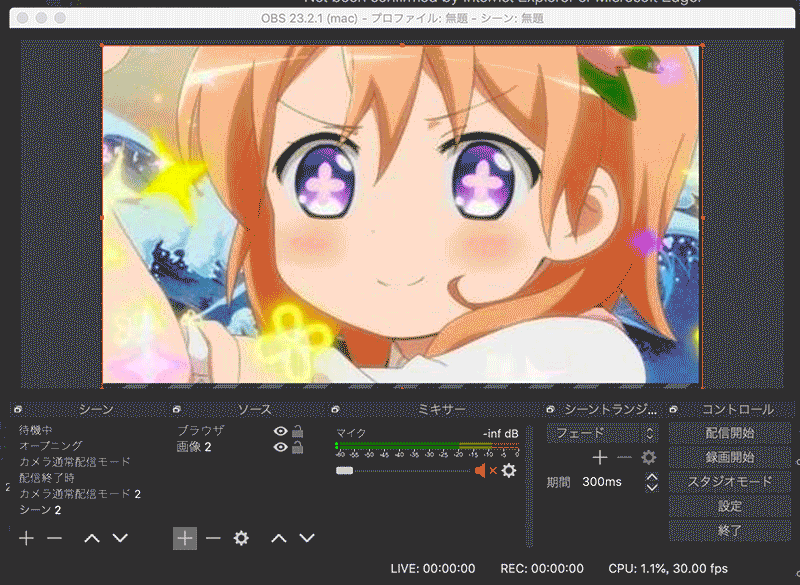

# Vue Stream Overlay

An overlay using the browser source function of Open Broadcaster Software.

This is a modified version of [haganbmj/vue-stream-overlay](https://github.com/haganbmj/vue-stream-overlay) .

## Warning

This tool does not take any security measures. Therefore, **Please do not expose to the Internet.**

## Required environment

- **Latest** Web browser 
  - using Webkit / Blink / Gecko as rendering engine
  - Not been confirmed by Internet Explorer or Microsoft Edge.
- PHP 7.1 or higher
- Open Broadcaster Software
- HTTP server (if possible)

## Getting Started

1. Clone this repository and go to the cloned directory.
2. Set the HTTP server document root to this directory.
3. Add browser source in OBS. Name the file `http://localhost/sample.html`
4. Open the `http://localhost/` from the browser.

## FAQ

### Is it OK to use a PHP built-in server?

Exactly.
